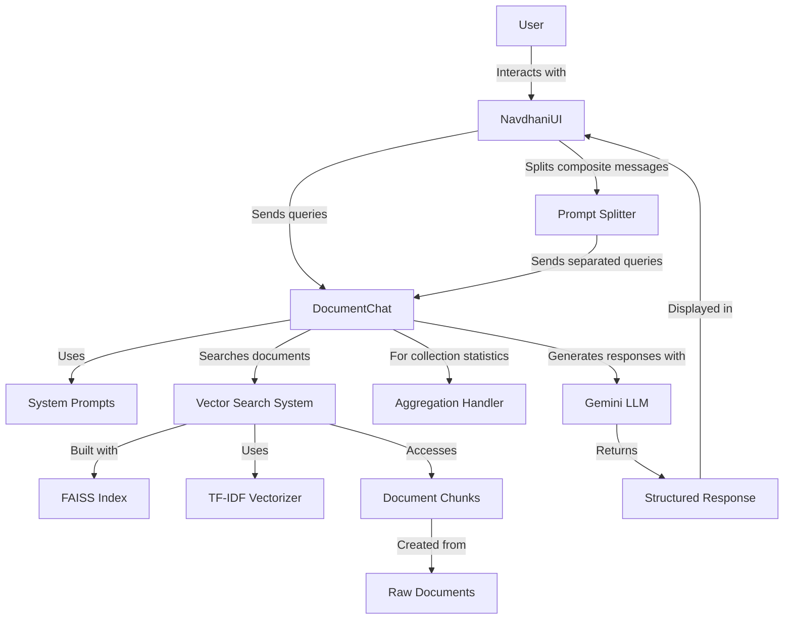

# Navadhāni: Design Specification

This document bridges the gap between the product specifications and the actual code implementation of Navadhāni, the Indian History of Science Chatbot.

## System Architecture

Navadhāni is built with a modular architecture consisting of several key components:

1. **DocumentChat**: Core engine that processes documents, handles search, and generates responses
2. **NavdhaniUI**: User interface layer built with Gradio for interaction
3. **Support Components**:
   - Prompt splitter for composite query handling
   - Aggregation handler for collection-level statistics
   - System prompts provider for different conversation styles



For more detailed diagrams, including component relationships, detailed system flow, and sequence diagrams, see [design-diagrams.md](design-diagrams.md).

## Dependencies

The system relies on the following Python packages with minimum version requirements:

| Package | Minimum Version | Purpose |
|---------|----------------|---------|
| pandas | 1.3.0 | Data manipulation and management |
| numpy | 1.20.0 | Numerical operations and array handling |
| faiss-cpu | 1.7.0 | Vector similarity search |
| scikit-learn | 1.0.0 | TF-IDF vectorization |
| nltk | 3.6.0 | Text tokenization |
| scipy | 1.7.0 | Sparse matrix operations |
| gradio | 3.50.0 | User interface creation |
| google-generativeai | 0.8.4 | Gemini LLM integration |
| python-dotenv | 0.19.0 | Environment variable management |
| websockets | 13.0.0 | Real-time communication |
| urllib3 | 2.0.0 | HTTP client |
| ipython | 8.0.0 | Interactive mode support |
| typing-extensions | 4.0.0 | Enhanced type hints |

## Code to Spec Mapping

The following table maps key product specifications to their implementation in the codebase:

| Product Specification | Implementation | Code Reference |
|----------------------|----------------|---------------|
| Document search and retrieval | TF-IDF vectorization with FAISS | `DocumentChat.search_documents()` |
| Text chunking | Sentence-based chunking with overlap | `DocumentChat.create_chunks()` |
| Gemini AI integration | API integration with system prompts | `DocumentChat.__init__()` | 
| Structured responses | JSON format with answer, references, confidence | `DocumentChat.generate_response()` |
| Query type detection | Pattern and keyword matching | `DocumentChat.needs_document_context()`, `is_aggregation_query()`, `is_conversational_query()` |
| Composite message handling | Prompt splitting | `NavdhaniUI.respond()` with `prompt_splitter` |
| Collection statistics | Aggregation handling | `DocumentChat.perform_aggregation()` |
| Token usage tracking | Metadata extraction from API responses | `NavdhaniUI.update_stats()` |

## Key Classes and Their Responsibilities

### DocumentChat

This is the core engine that handles:
- Document processing with `load_and_process_data()`
- Text chunking with `create_chunks()`
- Vector search with `search_documents()`
- Response generation with `generate_response()`
- Query classification with methods like `is_aggregation_query()`
- Collection statistics with `perform_aggregation()`

**Code-Spec Connection**:
- Implements core features #1-5 from product spec
- Handles document search, chunking, and response generation
- Uses TF-IDF and FAISS as specified

### NavdhaniUI

The user interface layer built with Gradio that:
- Manages conversation with `respond()`
- Tracks token usage with `update_stats()`
- Handles message history navigation
- Manages example queries
- Controls the Gradio interface with `launch()`

**Code-Spec Connection**:
- Implements UI components section from product spec
- Creates two-pane interface with chat and stats
- Provides query history navigation
- Shows token usage statistics

### DocumentChunk

A dataclass that represents a chunk of text from a document with metadata:
- `paper`: Title of the paper
- `author`: Author of the paper
- `url`: URL to the paper
- `text`: The text content
- `original_idx`: Original index in the dataframe
- `chunk_idx`: Chunk index within the document

**Code-Spec Connection**:
- Implements the data structure for text chunking (Core Feature #2)
- Maintains document metadata for generating references

### Supporting Components

#### Prompt Splitter

Handles composite message processing by:
- Splitting complex queries into simpler ones
- Classifying queries by type
- Supporting hybrid splitting methods

**Code-Spec Connection**:
- Implements composite message handling (Core Feature #6)
- Supports multiple query types as specified

#### LLMAggregationHandler

Specialized component for collection-level statistics:
- Processes aggregation queries
- Provides database-like functionality
- Generates statistical summaries

**Code-Spec Connection**:
- Implements collection statistics capabilities
- Handles "aggregation" query type

#### System Prompts

Provides different conversation styles:
- Default: Standard information delivery
- Conversational: More friendly and engaging
- Expert: Detailed, academic style

**Code-Spec Connection**:
- Implements the configurable system prompts from LLM Integration section

## Data Flow

1. **Input Processing**:
   - User query is received by NavdhaniUI
   - Query is potentially split by the prompt splitter
   - Query type is determined (document, aggregation, conversational)

2. **Document Search** (for document queries):
   - Query is vectorized using TF-IDF
   - FAISS index is searched for similar document chunks
   - Top matches are retrieved and deduplicated by source document

3. **Response Generation**:
   - For document queries: Relevant chunks form context for the LLM
   - For aggregation queries: Collection statistics are generated
   - For conversational queries: Direct LLM interaction without document context

4. **Output Formatting**:
   - Structured response with answer text
   - References to source documents when applicable
   - Confidence level indication
   - For composite queries, multiple responses are combined

5. **UI Updates**:
   - Chat history is updated
   - Token usage statistics are updated
   - Prompt information is displayed

For a detailed view of this process flow, see the sequence diagram in [design-diagrams.md](design-diagrams.md).

## Implementation Notes

### Document Processing

Documents are processed in the following steps:
1. Load TSV file with pandas
2. Clean and prepare text
3. Split documents into overlapping chunks
4. Create TF-IDF vectors for each chunk
5. Build FAISS index for efficient similarity search

### Query Processing

The system handles different types of queries:
- **Document queries**: Use document context from vector search
- **Aggregation queries**: Generate collection statistics
- **Conversational queries**: Direct interaction without document context
- **Composite queries**: Split into multiple sub-queries and process each

### Response Format

Responses are structured in JSON format:
```json
{
  "answer": "The detailed answer text",
  "references": [
    {
      "title": "Paper Title",
      "author": "Author Name",
      "url": "https://paper.url"
    }
  ],
  "confidence_level": "high|medium|low"
}
```

This structure ensures consistent information delivery across all query types.

## Extensibility Points

The system is designed to be extended in the following ways:

1. **Alternative Embedding Methods**: Replace TF-IDF with modern embeddings
2. **Different LLM Providers**: Replace Gemini with other LLM APIs
3. **Additional Query Types**: Add new query classifiers and handlers
4. **Enhanced UI Components**: Add new Gradio elements for additional functionality
5. **New Document Sources**: Import different document formats beyond TSV