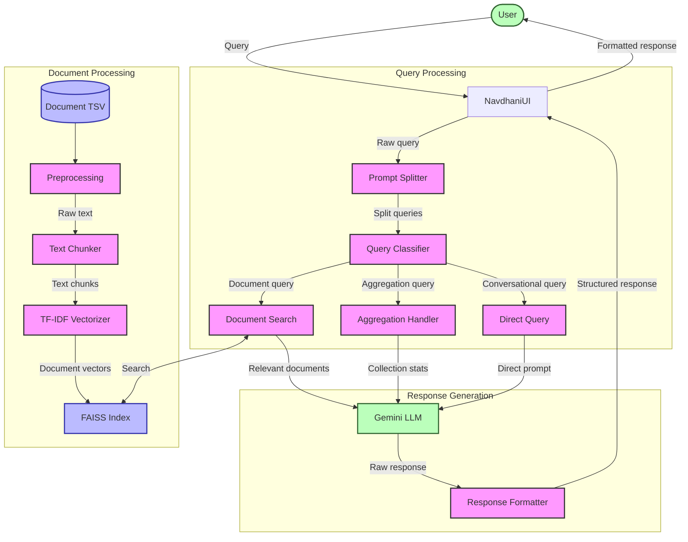
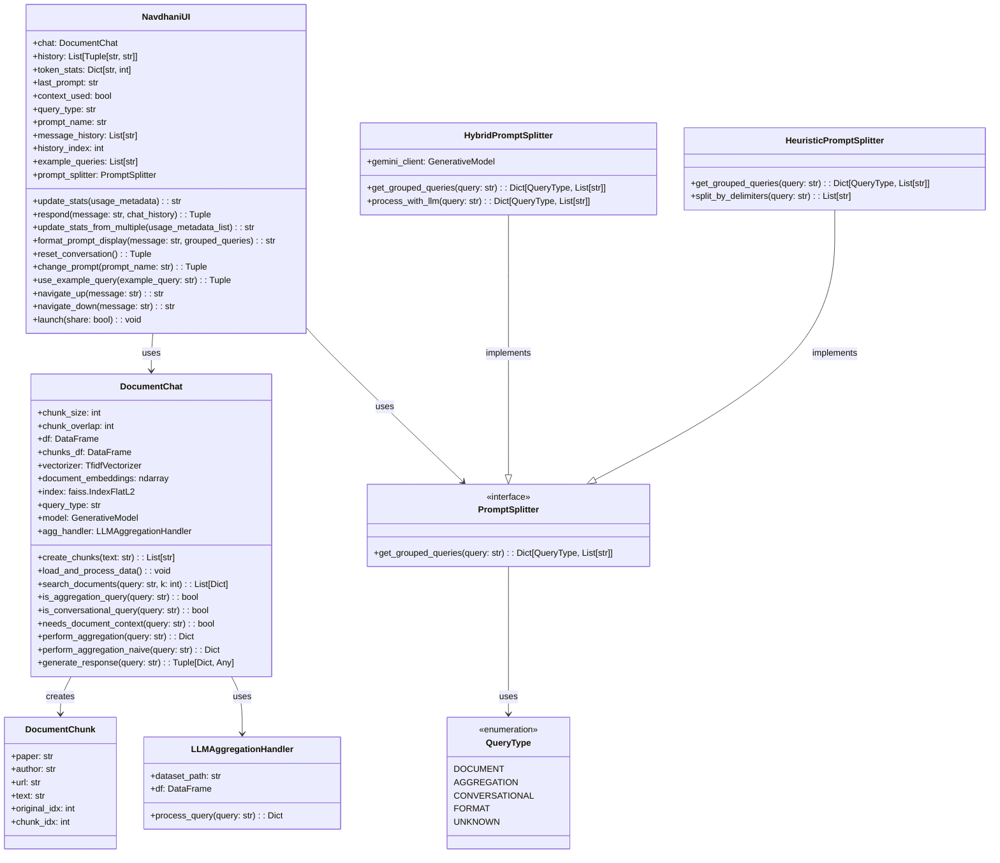
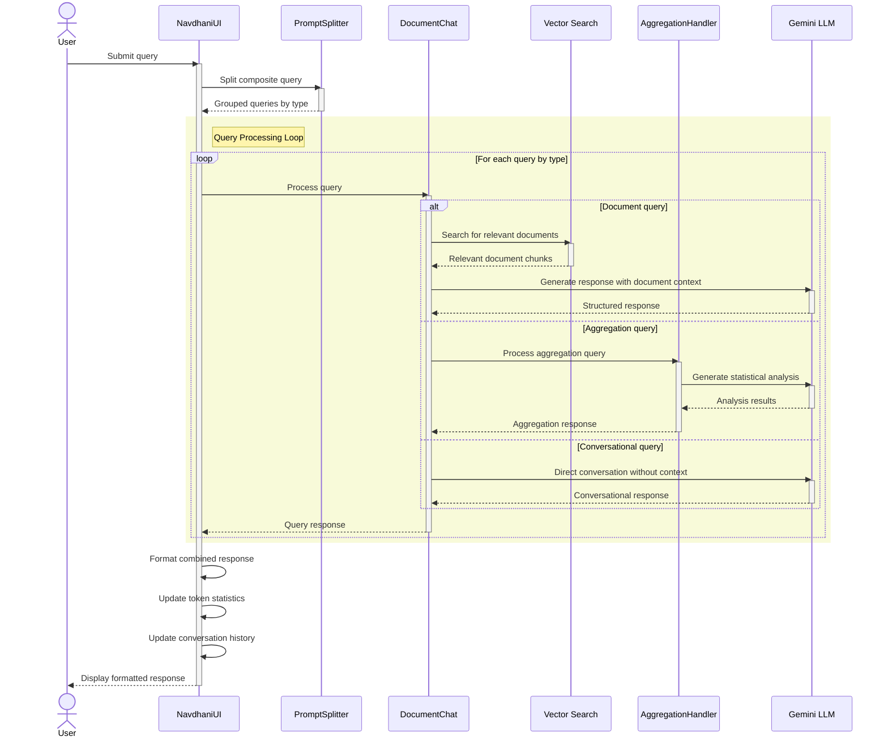

# Navadhāni System Architecture

This file contains detailed architecture diagrams for the Navadhāni document chat system.

## Core System Flow



## Component Relationships



## Data Flow Sequence

### Query Processing Sequence



### Data Ingestion Sequence

```mermaid
sequenceDiagram
    participant Main as Main Application
    participant DC as DocumentChat
    participant DF as Document File (TSV)
    participant PD as Pandas
    participant NLTK as NLTK
    participant TFIDF as TF-IDF Vectorizer
    participant FAISS as FAISS Index
    participant AH as Aggregation Handler
    participant LLM as Gemini LLM API
    participant UI as NavdhaniUI

    Main->>DC: Initialize DocumentChat
    activate DC
    
    DC->>DF: Load document TSV
    activate DF
    DF-->>PD: Raw data
    activate PD
    PD-->>DC: DataFrame with documents
    deactivate PD
    deactivate DF

    DC->>DC: Preprocess text
    
    DC->>NLTK: Initialize tokenizers
    activate NLTK
    NLTK-->>DC: Tokenization ready
    deactivate NLTK
    
    DC->>DC: Create document chunks
    Note over DC: Split texts into chunks with overlap
    
    DC->>TFIDF: Initialize vectorizer
    activate TFIDF
    DC->>TFIDF: Fit on document chunks
    TFIDF->>DC: Return fitted vectorizer
    DC->>TFIDF: Transform chunks to vectors
    TFIDF-->>DC: Document embeddings
    deactivate TFIDF
    
    DC->>FAISS: Initialize index
    activate FAISS
    DC->>FAISS: Add document vectors
    FAISS-->>DC: Index ready
    deactivate FAISS
    
    DC->>LLM: Initialize Gemini API client
    activate LLM
    LLM-->>DC: API client ready
    deactivate LLM
    
    DC->>AH: Initialize aggregation handler
    activate AH
    AH-->>DC: Aggregation handling ready
    deactivate AH
    
    DC-->>Main: DocumentChat initialized
    deactivate DC
    
    Main->>UI: Initialize NavdhaniUI with DocumentChat
    activate UI
    UI->>UI: Setup Gradio interface
    UI-->>Main: UI ready
    deactivate UI
    
    Main->>UI: Launch UI
    activate UI
    UI-->>Main: Serving on local/public URL
    deactivate UI